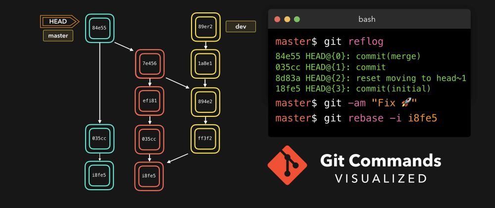

# Инструкция по Git (1 часть)

## Git - программа для контроля версий

В программировании проблемы совместной работы над проектами возникли ещё до появления облачных сервисов.

 > Git — самая популярная система контроля версий, но не единственная. Алгоритм работы подобных систем схож.

 Программа Git берёт на себя контроль версий проекта и позволяет переключаться между ними. Обратите внимание: Git хранит ** не файлы целиком, а отличия между ними.** Это позволяет экономить память. 
  Автор программы — Линус Торвальдс, создатель ОС Linux.

  Для работы нужно установить Git: [ссылка на Git](https://git-scm.com)

## Команды Git

Осваивать Git проще процессе редактирования текстовых файлов. Markdown – язык разметки, который позволяет форматировать текст. Для написания в редакторе VS Code используется синтаксис языка.
Все команды задаём при помощи написания кода в терминале.
Прежде чем создавать репозиторий и инициализировать Git, проверим текущую установленную версию пограммы. Для этого в терминале введём команду:

**git --version**

Если Git установлен на компьютер, вы увидите его текущую версию.
Программа использует мнемонические команды, которые легко запомнить, если знать  английский язык.

## Создание Git-репозитория:

* ляляля ничего не исправила
* Клонируем существующий репозиторий  из любого места.

### git init 

1. Инициализация: указываем папку, в которой git начнёт отслеживать изменения
1. В папке создаётся скрытая папка .git

### git status 

* Показывает текущее состояние гита, есть  ли изменения, которые нужно закоммитить (сохранить)

> Чтобы вызвать ранее введённую команду, пользуемся стрелками на клавиатуре. Перебираем недавно введённые команды нажатием стрелки «вверх».

### git add 

* добавляет содержимое рабочего каталога 
в индекс (staging area) для последующего коммита. Эта команда дается после добавления файлов. Писать название целиком не обязательно: терминал дозаполнит

### git commit 

* зафиксировать или сохранить

По умолчанию git commit использует лишь этот индекс, так что вы можете использовать git add  для сборки слепка вашего следующего коммита.
Команда git commit берёт все данные, добавленные в индекс с помощью git add, и сохраняет их слепок во внутренней базе данных, а затем сдвигает указатель текущей ветки на этот слепок.

### git log 

* Журнал изменений
* Перед переключением версии файла в Git используйте команду git log, чтобы увидеть количество сохранений

### git checkout 

* Переключение между версиями.
* Для работы нужно указать не только интересующий вас коммит, но и вернуться  в тот, где работаем, при помощи команды  git checkout master.

> Нажатие клавиши ‘q’ возвращает  в исходное окно терминала.

### git diff 

* Показывает разницу между текущим файлом и сохранённым
* Перед переключением версии файла в Git используйте команду git log, чтобы увидеть количество сохранений

[Материал взят с GeekBrains](https://gb.ru)
